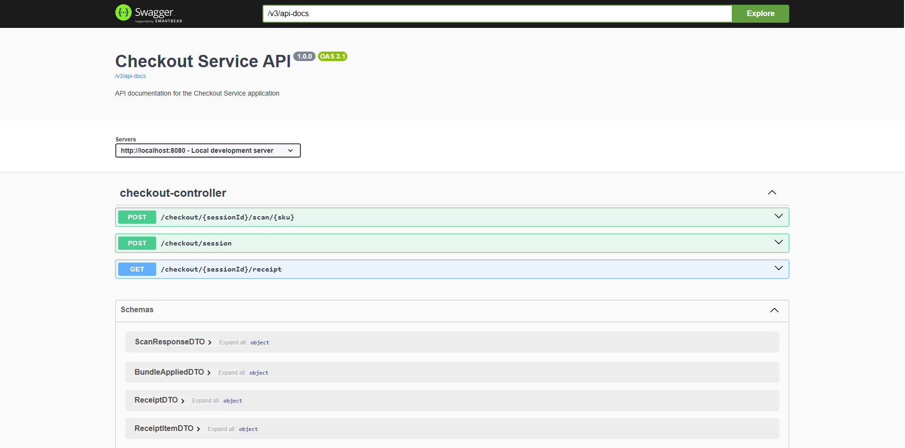
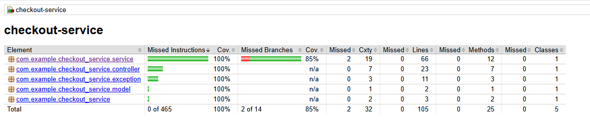

# Checkout Service

## Overview

This project implements a **stateful checkout service** for a market scenario. The service allows scanning items, applying **multi-price rules** and **bundle discounts**, and generating receipts.

Key features:

* Scan items into a checkout session.
* Apply multi-price rules (e.g., buy 3 of item A for a special price).
* Apply bundle discounts (e.g., buying item X with item Y reduces total).
* Generate receipts with detailed item pricing and applied discounts.
* Exposes a **REST API** without any UI.
* Data is persisted in a **file-based H2 database**, so cart and pricing information survives application restarts.
* The application automatically **initializes default data** if none exists in the database.
* Integrated **Swagger/OpenAPI documentation** for easy exploration of the API.

---

## How to Build and Run

### Prerequisites

* Java 21+
* Maven 3+
* Git

### Clone and Build

```bash
git clone https://github.com/KomendaKacper/Checkout-service.git
cd Checkout-service
mvn clean install
```

### Run

```bash
mvn spring-boot:run
```

The service will start on **[http://localhost:8080](http://localhost:8080)**.

Swagger UI is available at **[http://localhost:8080/swagger-ui.html](http://localhost:8080/swagger-ui.html)**.

---

## Using the Checkout Service

### 1. Start a Checkout Session

```http
POST /checkout/session
```

Response:

```json
"123e4567-e89b-12d3-a456-426614174000"
```

* Returns a `sessionId` used for all subsequent calls.

---

### 2. Scan Products

Add products to the checkout session using the SKU:

**SKU (Stock Keeping Unit)** – a unique product code used to identify each item in the system. Every product has its own SKU, which allows for quick scanning, inventory tracking, and accurate pricing.

```http
POST /checkout/{sessionId}/scan/{sku}
```

Example:

```bash
curl -X POST http://localhost:8080/checkout/123e4567-e89b-12d3-a456-426614174000/scan/A
```

Response:

```json
{
  "sku": "A",
  "name": "Product A",
  "quantity": 1
}
```

* Each call increments the quantity of the product in the session.
* Multiple scans of the same SKU accumulate in the cart.

---

### 3. Checkout and Get Receipt

After scanning all items, get the final receipt:

```http
GET /checkout/{sessionId}/receipt
```

Example:

```bash
curl -X GET http://localhost:8080/checkout/123e4567-e89b-12d3-a456-426614174000/receipt
```

Sample response:

```json
{
  "items": [
    {
      "name": "Product C",
      "unitPrice": 30.00,
      "discountedUnitPrice": 30.00,
      "quantity": 1,
      "totalPrice": 30.00
    },
    {
      "name": "Product B",
      "unitPrice": 10.00,
      "discountedUnitPrice": 10.00,
      "quantity": 1,
      "totalPrice": 10.00
    },
    {
      "name": "Product A",
      "unitPrice": 40.00,
      "discountedUnitPrice": 30.00,
      "quantity": 3,
      "totalPrice": 90.00
    },
    {
      "name": "Product D",
      "unitPrice": 25.00,
      "discountedUnitPrice": 25.00,
      "quantity": 1,
      "totalPrice": 25.00
    }
  ],
  "appliedBundles": [
    {
      "sku1": "A",
      "sku2": "B",
      "quantity": 1,
      "discount": 2.50
    },
    {
      "sku1": "C",
      "sku2": "D",
      "quantity": 1,
      "discount": 5.00
    }
  ],
  "total": 147.50
}

```

---

### 4. Session Persistence

* Sessions are stored in a **file-based H2 database**.
* You can continue a session using the same `sessionId` after restarting the application.

---

### 5. Example Workflow with `curl`

#### Start Session

```bash
curl -X POST http://localhost:8080/checkout/session
```

#### Scan Products

```bash
curl -X POST http://localhost:8080/checkout/{sessionId}/scan/A
curl -X POST http://localhost:8080/checkout/{sessionId}/scan/A
curl -X POST http://localhost:8080/checkout/{sessionId}/scan/A
curl -X POST http://localhost:8080/checkout/{sessionId}/scan/B
```

#### Checkout

```bash
curl -X GET http://localhost:8080/checkout/{sessionId}/receipt
```

---

### 6. Endpoint Summary

| Endpoint                           | Method | Description                                         |
| ---------------------------------- | ------ | --------------------------------------------------- |
| `/checkout/session`                | POST   | Start a new checkout session and return `sessionId` |
| `/checkout/{sessionId}/scan/{sku}` | POST   | Scan a product and add it to the session            |
| `/checkout/{sessionId}/receipt`    | GET    | Generate the receipt with discounts and total       |

---

### 7. Running Tests and Test Coverage

The project uses **JaCoCo** to generate test coverage reports. After running the unit tests:

```bash
mvn test
```

* Open the report at:

```
target/site/jacoco/index.html
```

* The report provides detailed metrics on **line coverage, branch coverage, and method coverage** for your code.
* This helps ensure that your tests cover critical parts of the application and identify areas needing more tests.

---

### 8. Conclusion

Checkout Service provides a flexible and stateful checkout system for managing products, applying multi-price rules, bundle discounts, and generating detailed receipts.

With persistent storage, the service ensures that checkout sessions survive application restarts, making it reliable for testing and real-world scenarios.

For further exploration, you can use the Swagger UI to test endpoints and inspect request/response formats.